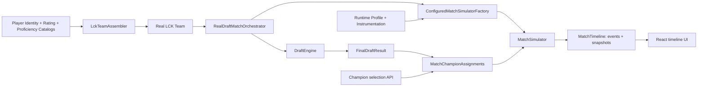

# System Overview

이 문서는 production Java와 active resource manifest를 기준으로 subsystem의 책임과 경계를 설명한다. 현재 수치와 활성화 상태는 [Project Status](../project-status.md), 세부 계약은 각 architecture/reference 문서를 따른다.

## 전체 흐름

두 진입 경로는 현재 동일하게 공개되어 있지 않다.

- `GET /api/champions`와 `POST /api/matches/simulate`는 Spring API에 연결되어 있다.
- `RealDraftMatchOrchestrator`는 Spring application component로서 실제 LCK team assembly, real `DraftTeamContext`, `DraftEngine`, final assignment preflight와 `MatchSimulator`를 하나의 deterministic backend 호출로 연결한다.
- 이 orchestration은 아직 Controller나 frontend에 노출되지 않았다. `MatchController` 기본 roster와 현재 frontend flow는 계속 dummy path다.

## Major Subsystems

| Subsystem | 책임 | 주요 코드 |
| --- | --- | --- |
| Champion | champion identity, legal role, power/matchup/composition/jungle resource 로딩과 검증 | `com.lolfm.champion.*`, `com.lolfm.composition.*` |
| Player | stable person identity, 현재 roster mapping, 일반 능력치, champion proficiency, 실제 팀 조립, match-scoped performance | `com.lolfm.player.*`, `com.lolfm.domain.PlayerRatings`, `ChampionProficiencies` |
| Draft | legal candidate 생성, pick/ban 평가, search, flex role 최종 배정, series exclusions | `com.lolfm.draft.*` |
| Application orchestration | real team assembly, Draft-owned assignment 검증·전달, caller-owned series commit | `com.lolfm.application.*` |
| Match Simulation | tick 순서, resolver priority, mutable match state, event/snapshot, 종료 | `com.lolfm.simulator.MatchSimulator` |
| Progression | XP, level, gold, item stage와 그에 따른 실제 경기 전투 기여 | `PlayerProgressionState`, `ProgressionEconomyResolver`, `CombatProgressionEvaluator` |
| Matchup | 같은 `Position`의 두 champion 사이 구조적 상호작용 | `ChampionMatchupEvaluator`, `ChampionMatchupResolver` |
| Composition | 5인 lineup의 기능 조합, 결핍, context edge와 승인된 decision-channel 적용 | `TeamCompositionAnalyzer`, `CompositionRuntimeState` |
| API / frontend | champion catalog 제공, simulation 실행, timeline 재생 | `ChampionController`, `MatchController`, `frontend/src/App.tsx` |

## Core Responsibility Boundaries

| 개념 | 소유 책임 | 포함하지 않는 것 |
| --- | --- | --- |
| Champion Power | champion 자체의 level/item progression curve와 combat context baseline | 상대 champion, 선수의 일반 실력, 현재 gold/level 자체 |
| Champion Matchup | `ChampionRoleKey` 대 `ChampionRoleKey`의 구조적 capability/exposure 상호작용 | 현재 승률, team-wide composition, 선수 숙련도 |
| Champion Composition | 5인 lineup이 제공하는 engage, peel, damage channel 등의 기능과 결핍 | 특정 lane opponent와의 1:1 우열, champion 개인 성장 curve |
| Player Identity | `PlayerId` 사람 identity, `PlayerRatingKey` current roster slot, `PlayerKey` match slot | nickname 기반 identity 추론, display text lookup |
| Player Ratings | 선수의 일반적·role-specific 능력 | 특정 champion 숙련도, 경기 중 획득 자원 |
| Champion Proficiency | 특정 `PlayerId`가 자신의 position에서 특정 `ChampionRoleKey`를 수행하는 숙련도 | 일반적인 decision/farming 능력, champion의 고유 power curve |
| Progression | 그 경기에서 획득한 XP, level, gold, item stage와 death/respawn 상태 | authored baseline rating이나 champion kit 정의 |

이 경계를 유지해야 같은 신호를 여러 계층에서 중복 계산하지 않는다. 예를 들어 현재 `CombatProgressionEvaluator`는 progression edge에 Champion Power와 role Matchup을 순서대로 더하지만, 각 evaluator의 입력과 breakdown은 분리한다. Composition은 별도의 team context를 만들고 decision channel에 적용하므로 개인 power나 pair matchup으로 재해석하지 않는다.

관련 상세 문서:

- [Champion System](champion-system.md)
- [Player System](player-system.md)
- [Draft System](draft-system.md)
- [Match Simulation](match-simulation.md)

## High-Level Runtime Flow

1. Active manifest가 coherent champion resource set을 선택하고 cross-catalog coverage를 검증한다.
2. 실제 roster path는 identity, rating, sparse proficiency resource의 version/hash/subject equality를 검증하고 `LckTeamAssembler`가 explicit `PlayerId`를 가진 팀을 만든다.
3. legacy HTTP는 champion selection을 materialize하고, real backend path는 `RealDraftMatchOrchestrator`가 동일 Team으로 Draft를 실행한 뒤 `FinalDraftResult.matchChampionAssignments()`를 재해석 없이 선택한다.
4. real path의 stateless preflight가 explicit team code, current `PlayerRatingKey`, roster `PlayerId`, Draft context, final role legality, assignment equality, series exclusions를 검증한다.
5. real path는 closed runtime profile과 별도 instrumentation을 resolve해 configured simulator를 만들고, `MatchSimulator`가 fresh `GameState`, 두 `TeamState`, 열 `PlayerState(PlayerKey, PlayerId, displayName)`를 생성한다.
6. 고정 resolver 순서로 tick을 진행하며 seed 기반 `Random`을 소비한다.
7. actual action만 gameplay state와 summary event를 만들고, kill은 공통 reward/death path를 통과한다.
8. 매 tick 뒤 `MatchSnapshot`이 추가되고, Nexus 파괴 또는 safety timeout으로 `MatchTimeline`이 완성된다.
9. frontend는 event text를 gameplay identity로 역해석하지 않고 structured fields와 snapshots를 표시한다.

## 실제 Spring Wiring

`MatchController`가 직접 주입받는 `MatchSimulator`는 lane/gank/roam/objective/macro/progression/Champion Power를 활성화하지만 `ChampionMatchupMode.OFF`, `TeamCompositionGameplayMode.OFF`, Jungle Clear `DISABLED_NOT_INTEGRATED`를 사용한다. 이 exact gameplay snapshot은 `BASELINE_V1`과 같지만 HTTP path 자체는 아직 runtime profile selector를 노출하지 않는다.

`RealDraftMatchOrchestrator`는 `ConfiguredMatchSimulatorFactory`를 주입받고 closed `SimulationRuntimeProfileId`를 registry에서 다시 resolve한다. 기존 overload는 `BASELINE_V1`, additive overload는 Matchup/Composition/Jungle Economy/Jungle Tempo candidate를 포함한 등록 profile을 선택하며 diagnostics는 별도 `SimulationInstrumentation`으로 전달한다. 임의 boolean 묶음이나 caller-fabricated resolved profile은 이 application 경계를 통과할 수 없다.

Draft resource wiring은 Spring의 `ChampionCatalog` instance를 재사용해 active power/matchup/composition resource를 검증하고 `DraftEngine`을 구성한다. `MatchController`는 이 orchestration을 주입받지 않고 `DummyDataFactory`를 계속 사용하므로 backend real path와 HTTP demo path를 구분해야 한다.

## Global Invariants

- Gameplay identity는 `TeamSide`, `Position`, `Lane`, `ChampionId`, `ChampionRoleKey`, `PlayerId`, `PlayerRatingKey`, `PlayerKey` 같은 구조화된 값으로 표현한다. `PlayerId`는 사람, `PlayerRatingKey`는 current roster slot, `PlayerKey`는 match slot을 뜻하며 display name과 event message는 identity가 아니다.
- Mutable gameplay state는 현재 match의 `GameState`, `TeamState`, `PlayerState` 또는 match-owned state에 둔다. resolver는 match 간 상태를 보유하지 않는다.
- Resolver evaluation, trigger success, actual attempt, combat outcome, actual kill은 서로 다른 단계다. 평가 또는 trigger 실패만으로 major-combat slot, FARM 제한, cooldown, gameplay summary event를 소비하지 않는다.
- 높은 priority resolver가 actual attempt를 만들지 못하면 낮은 priority resolver로 fall through한다. actual attempt가 시작되면 `NO_KILL`이어도 해당 규칙에 따라 slot과 opportunity cost를 소비할 수 있다.
- 한 tick의 major combat은 central priority flow와 match-owned participant registry로 제한한다.
- kill, assist, shutdown, death, respawn은 공통 reward/death path를 사용한다. summary action event와 연결된 `KILL` event는 하나의 combat을 설명한다.
- FARM opportunity cost는 이미 획득한 CS를 빼지 않고 blocked tick으로 표현한다. passive gold는 별도 규칙이 없는 한 계속 지급한다.
- 같은 seed, team, assignment, options에서는 resolver 실행 순서와 Random 소비 순서가 같아야 한다. diagnostics는 이를 관찰할 뿐 변경하지 않는다.
- Active catalog 간 missing/extra/unsupported role은 startup/load 단계에서 실패해야 하며 silent fallback으로 숨기지 않는다.

이 invariant의 실제 simulator 적용 방식은 [Match Simulation](match-simulation.md), resource coverage는 [Champion Resource Schema](../reference/champion-resource-schema.md)를 참고한다.
